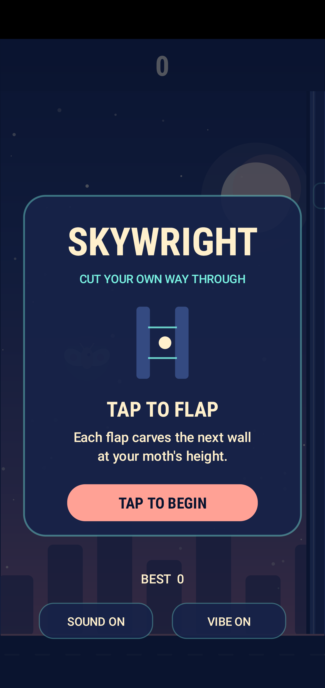
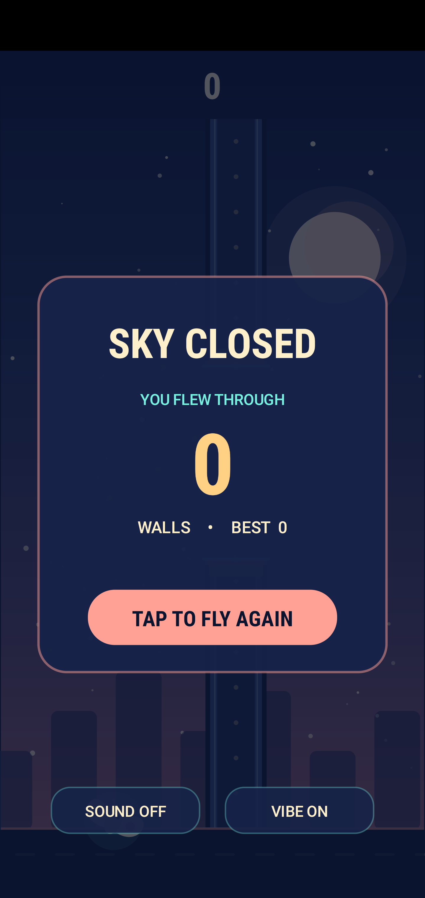

# Skywright

**Make the gap. Then make it through.** Skywright is a one-thumb Android arcade game about a moth flying through sealed paper walls. Every tap flaps upward and sends a pulse toward the next visible wall. The pulse cuts an opening at the moth's height when you tapped. That opening stays where you made it.



## Download and install

Download the signed [Skywright v1.0 APK](https://github.com/ColeT25/Skywright/releases/download/v1.0/Skywright-v1.0.apk) on an Android phone running Android 8.0 or newer. Open the downloaded file and allow installation from that source if Android asks. The APK installs directly; it does not require a Play Store account or an internet connection to play.

SHA-256: `797d30c7d217f3a5aedb8fff3c0eeb3341dc4cb0ac0f1e9285a313cf75c39564`

## How to play

- Tap anywhere to flap. Gravity pulls you back down.
- Your flap sends a pulse to the earliest visible wall that has no opening yet. When it arrives, it cuts a doorway at the moth's **tap-time height**.
- Fly through your doorway to score. One pulse opens each wall; later taps cannot move that opening.
- Tap the pause icon in the top-right corner during a run. Sound and vibration switches are on the menu, pause, and result screens. Best score and settings stay on the device.



## Build from source

This is a native Kotlin Android project with original Canvas artwork, a fixed-step simulation, and no external game engine or runtime permissions. The Gradle wrapper is included. With Android SDK Platform 36, Build Tools 36.0.0, and Java 17 installed:

```sh
bash ./gradlew testDebugUnitTest lintRelease assembleDebug
```

The signed release APK was built locally with a project-specific signing key. The key is intentionally outside this repository. See [GAME_PLAN.md](GAME_PLAN.md) for the complete game concept.

## Verification for v1.0

- Core simulation tests passed, including pulse height, one cut per wall, late-pulse failure, collision, scoring, pause behavior, and a multi-wall playable path.
- Android release lint completed with 0 errors and 4 nonblocking warnings (target SDK version, intentional portrait orientation, and an adaptive-icon resource qualifier).
- The release APK passed alignment and Android v2/v3 signature verification.
- The exact signed release APK installed and launched on a Pixel 4 XL Android 11 emulator. Menu, gameplay opening, pause, and sound toggle were visually checked. Physical phone play testing remains to be done.

## Project structure

- `GameCore.kt`: Android-free physics, pulse targeting, wall state, collision, and scoring.
- `SkywrightView.kt`: touch input, fixed-step frame pacing, lifecycle pause, and settings.
- `Renderer.kt`: original paper-sky visuals drawn with Canvas.
- `GameAudio.kt`: local synthesized feedback.
